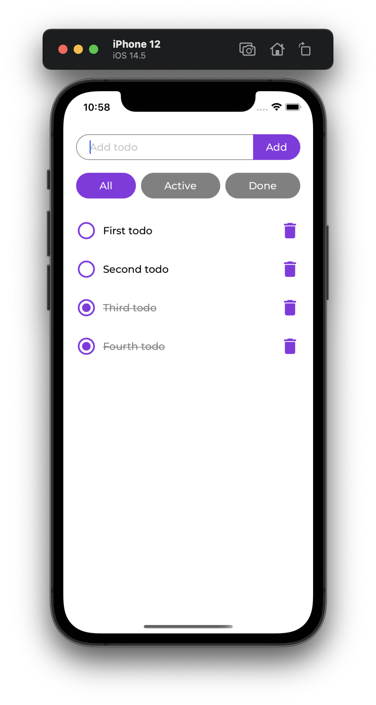

# Quick Guide to React Native Testing

## Why Write Tests?

Writing tests can help you make your app more robust, your team happier, and save you a lot of time in the long term. Another, less obvious reason is that good tests reflect good architecture. When your code has a coherent structure, proper separation of concerns, and follows conventions, writing tests should be a breeze.

The ease of testing is one of the best parts of React/Redux architecture. Everything in React/Redux is a plain JavaScript object at some point. That makes testing it as simple as checking its properties. So when you're not writing tests for your React Native app you're missing out on one of its best features.

## Unit, Integration or End-to-end?

You've probably heard "Write tests. Not too many. Mostly integration." There are many different paradigms when it comes to testing, with varying emphasis on unit, integration, and end-to-end. But generally speaking, when it comes to impact/effort and working with a continuously changing codebase, unit tests are your best bet.

Unit tests make it possible to test different parts of your app independently, are fast, easy to maintain, and incentivise developers to take responsibility for their work. But more importantly, unit tests cover the basic building blocks of your code, creating a solid foundation for higher-level tests (e.g. integration) making them simpler and more focused.

## What Are Good Tests?

So what makes good tests? Speed, isolation, and repeatability are some of the things often mentioned. Also, good tests imitate real case scenarios without creating complexity. Simply checking if a component gets rendered probably won't cut it, but testing every detail of a component's implementation is likely to make your tests slow and fragile.

Simply put, the payoff should always be greater than the cost of writing and maintaining your tests. After all, you'd rather be writing your app than tests. The tests are meant to help you get there safer, faster, and with a minimal amount of setback. So while writings tests can make your code more robust, don't waste your time trying to cover every detail.

## Example App

Let’s consider these ideas in the context of a simple React Native [todo app](https://github.com/stassop/ReactNativeTodo).



Run the app
```
npx react-native run-ios
```

Run the backend
```
node server/app.js
```

Run the tests
```
npm test
```

## Testing Components

Testing React Native components is a breeze with [Jest](https://jestjs.io/) and [Test Renderer](https://reactjs.org/docs/test-renderer.html). Because React's [Virtual DOM](https://reactjs.org/docs/faq-internals.html) is basically an object, you can test components by parsing them and checking their properties. Test Renderer converts components to plain JavaScript objects, without any native dependencies.

When testing components, don't get carried away with details. Only test things the component's core functionality depends on, e.g. rendering other components, dispatching actions etc. Avoid testing things that aren't vital for the component's behaviour and/or can change often.

Consider this simple [Todo component](https://github.com/stassop/ReactNativeTodo/blob/master/components/Todo.js). It does two things: toggling the todo's done state and deleting the todo. Because it's a unit test it should be agnostic about its context. So we spy on the component's internal functions and mock everything outside of it (keep in mind this is a snippet from a [bigger file](https://github.com/stassop/ReactNativeTodo/blob/master/__tests__/components/Todo.test.js)):

```
// Todo.test.js

const useDispatchMock = jest.fn();
jest.spyOn(reactRedux, 'useDispatch').mockReturnValue(useDispatchMock);

describe('Todo', () => {
  it('Handles user actions', () => {
    const renderer = TestRenderer.create(
      <Todo id={ 123 } done={ false } />
    );
    const root = renderer.root;
    const checkbox = root.findByType(Checkbox);

    checkbox.props.onChange(true);
    expect(useDispatchMock).toHaveBeenCalledWith(Actions.toggleTodo(123, true));
  });
});
```

An important part of the Todo component behaviour is that it looks a certain way when done, so that must be tested. Notice that the style is just a plain object. Because Test Renderer renders an object, the component's props are objects too. Also, because Checkbox has its own test, it's enough to check if it has the right props here:

```
it('Handles done state', () => {
  const renderer = TestRenderer.create(
    <Todo text={ 'Todo' } done={ true } />
  );
  const root = renderer.root;
  const checkbox = root.findByType(Checkbox);
  const text = root.findByProps({ children: 'Todo' });
  const doneStyle = {
    textDecorationLine: 'line-through',
    color: Colors.todoDone,
  };

  expect(checkbox.props.checked).toBe(true);
  expect(text.props.style).toContainEqual(doneStyle);
});
```

You can find the rest of the component tests [here](https://github.com/stassop/ReactNativeTodo/tree/master/__tests__/components).

## Testing Actions

Action tests are generally very basic but they allow you to rely on action creators in other tests without having to bother with their internals. If an action creator changes, you won't have to change every test that uses the action. To test an action creator simply call the function and compare the result to a plain object you expect to get back:

```
// actions.test.js

it('Creates CREATE_TODO action', () => {
  const action = { type: Actions.CREATE_TODO, text: 'Todo' };
  expect(Actions.createTodo('Todo')).toStrictEqual(action);
});
```

Testing async actions is a bit more tricky but quite simple once you get the idea. Mock the API methods the action relies on, dispatch the action, and check if the [Mock Store](https://github.com/reduxjs/redux-mock-store) has received the right actions:

```
import thunk from 'redux-thunk';
import configureMockStore from 'redux-mock-store';

const mockStore = configureMockStore([ thunk ]);

describe('Async actions', () => {
  it('Handles successful fetch', () => {
    const store = mockStore();
    const todos = [{ text: 'Text', id: 123, done: false }];
    // Mock async API method success
    const fetchTodosMock = jest.spyOn(Api, 'fetchTodos').mockResolvedValue(todos);

    const expectedActions = [
      Actions.fetchTodos(),
      Actions.fetchTodosSuccess(todos),
    ];

    // If a test returns nothing it will pass by default
    return store
      // Dispatch async action
      .dispatch(Actions.fetchTodosAsync())
      // Wait for async action to complete
      .then(() => {
        // Mocked method is called
        expect(fetchTodosMock).toHaveBeenCalled();
        // Expected actions are dispatched
        expect(store.getActions()).toStrictEqual(expectedActions);
      });
  });
});
```

You can find the rest of the action tests [here](https://github.com/stassop/ReactNativeTodo/blob/master/__tests__/actions/actions.test.js).

## Testing Reducers

Because Redux reducers are just [pure functions](https://en.wikipedia.org/wiki/Pure_function), to test them simply call them with an initial state and an action, and check the resulting state.

```
// reducers.test.js

import { rootReducer, initialState } from '../../reducers';
import * as Actions from '../../actions';

describe('rootReducer()', () => {
  it('Handles FETCH_TODOS', () => {
    const action = Actions.fetchTodos();
    const state = rootReducer(initialState, action);
    const expectedState = {
      ...initialState,
      fetching: true,
    };
    expect(state).toStrictEqual(expectedState);
  });
});
```

You can find the rest of the reducer tests [here](https://github.com/stassop/ReactNativeTodo/blob/master/__tests__/reducers/reducers.test.js).

## Testing Redux Saga

Although understanding [Redux Saga](https://redux-saga.js.org/) can sometimes be challenging, testing it is surprisingly easy. Testability is actually one of its best features. Because sagas are essentially [generator functions](https://developer.mozilla.org/en-US/docs/Web/JavaScript/Guide/Iterators_and_Generators), and every saga effect (e.g. put(), take(), etc.) returns a plain object, testing sagas is as simple as calling next(), and checking the yielded result. If an effect is expected to yield a value, pass it as an argument to the following next().

```
// sagas.test.js

describe('createTodo()', () => {
  it('Handles success', () => {
    const saga = createTodo(Actions.createTodo('Todo'));
    const todo = { id: 123, text: 'Todo', done: true };

    const yield1 = call(Api.createTodo, 'Todo');
    const yield2 = put(Actions.createTodoSuccess(todo));

    expect(saga.next().value).toStrictEqual(yield1);
    expect(saga.next(todo).value).toStrictEqual(yield2);
    expect(saga.next().done).toBe(true);
  });
});
```

You can find the rest of the saga tests [here](https://github.com/stassop/ReactNativeTodo/blob/master/__tests__/sagas/sagas.test.js).

## Integration Tests

Integration tests are meant to check if all the parts of our app work together as one. They provide a high-level overview without going into details. We create a single instance of the App component, together with all its constituents (e.g. reducers, sagas, etc.), to preserve its state throughout the tests. The only thing mocked here are the API endpoints because they are outside of the React/Redux scope.

```
import React from 'react';
import TestRenderer from 'react-test-renderer';
import { Provider } from 'react-redux';
import { createStore, applyMiddleware } from 'redux';
import createSagaMiddleware from 'redux-saga';
import thunk from 'redux-thunk';

import * as Api from '../../api';

import { rootReducer } from '../../reducers';
import { rootSaga } from '../../sagas';

const sagaMiddleware = createSagaMiddleware();
const store = createStore(rootReducer, applyMiddleware(thunk, sagaMiddleware));
sagaMiddleware.run(rootSaga);

jest.spyOn(Api, 'fetchTodos').mockResolvedValue([
  { id: 1, text: 'Todo one', done: false },
  { id: 2, text: 'Todo two', done: false },
]);

describe('App', () => {
  // Use async/await to allow for async calls to resolve
  // https://reactjs.org/docs/testing-recipes.html#data-fetching
  let root;
  beforeAll(() => TestRenderer.act(async () => {
    const renderer = await TestRenderer.create(
      <Provider store={ store }>
        <App />
      </Provider>
    );
    root = renderer.root;
  }));

  it('Fetches todos', () => {
    const todos = root.findAllByType(Todo);

    expect(todos).toHaveLength(2);
    expect(todos[0].props.text).toBe('Todo one');
    expect(todos[1].props.text).toBe('Todo two');
  });
});
```

Now we can call a component method to simulate user action, and expect it to take effect after it gets processed by sagas, reducers etc.

```
it('Creates todos', async () => {
  const textInput = root.findByType(TextInput);
  const createTodoMock = jest.spyOn(Api, 'createTodo')
    .mockResolvedValue({ id: 3, text: 'Todo three', done: false });

  // Wrap each call in act() for it to take effect before the next one
  await TestRenderer.act(async () => {
    textInput.props.onChangeText('Todo three');
  });

  await TestRenderer.act(async () => {
    textInput.props.onSubmitEditing();
  });

  const todos = root.findAllByType(Todo);

  expect(todos).toHaveLength(3);
  expect(todos[2].props.text).toBe('Todo three');
});
```

You can find the rest of the integration tests [here](https://github.com/stassop/ReactNativeTodo/blob/master/__tests__/integration/integration.test.js).

## Conclusion

Don't overthink tests, they are supposed to be a complement to your app, not a maintenance burden. Start writing tests from the ground up, gradually moving from the basic building blocks of your app to more complex ones. And remember, good code is testable code. If something is tricky to test, it could be a clue that it has to be split up into more atomic parts.

This article is intended to glance over React Native testing, and therefore is by no means complete. I strongly recommend you to explore other testing techniques and tools such as [Snapshot Testing](https://jestjs.io/docs/snapshot-testing), [Detox](https://github.com/wix/Detox), [React Native Testing Library](https://github.com/callstack/react-native-testing-library), and choose the ones that best suit your project.

## Resources

* https://reactjs.org/docs/test-renderer.html
* https://reactnative.dev/docs/testing-overview
* https://github.com/reduxjs/redux-mock-store
* https://redux-saga.js.org/docs/advanced/Testing/
* https://reactjs.org/docs/testing-recipes.html#data-fetching
